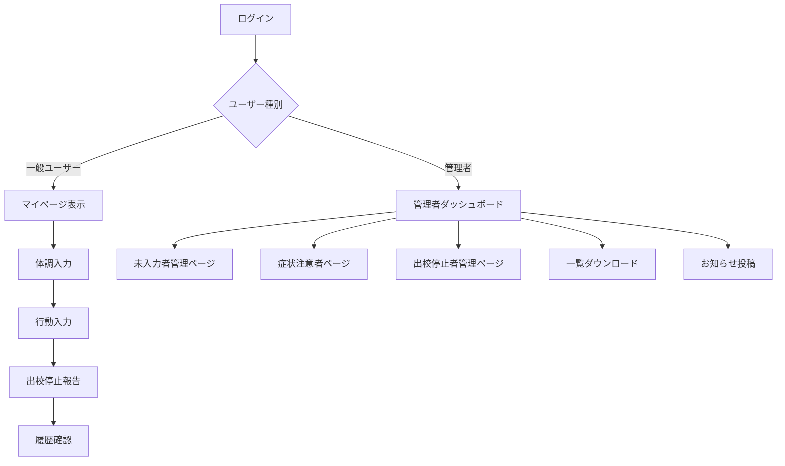

# アプリ仕様まとめ

## 共通機能

- **ログイン**
- **出校停止者報告**
- **未入力アラート**
- **マイページ**
  - 体調・行動履歴表示
  - 未入力アラート
  - お知らせ（全体・個人）
- **メニュー**
  - 体調入力
  - 行動入力
  - 出校停止報告
  - 履歴確認
  - 個人情報

---

## 管理者機能

- **未入力者管理ページ**
- **症状注意者ページ**
- **出校停止者管理ページ**
- **一覧ダウンロード機能**
- **お知らせ投稿**

---

## 必要なボタン

- ログイン／ログアウト
- 体調記録「入力」ボタン
- 行動記録「追加」ボタン
- 自宅のみ「一括入力」ボタン
- 出校停止「報告」ボタン
- 履歴「表示」ボタン
- 管理者側「未入力者連絡」ボタン
- 管理者側「要注意者通知」ボタン
- 管理者側「CSV出力」ボタン（オプション）
- 管理者側「入力者／未入力者表示切替」ボタン

---

## その他便利機能

- **メール通知連携**
  - 入力忘れ防止
  - 管理者からの一斉連絡
- **ダッシュボード表示（管理者側）**
  - 本日の体調異常件数
  - 出校停止者数
  - 未入力者数

## フローチャート

